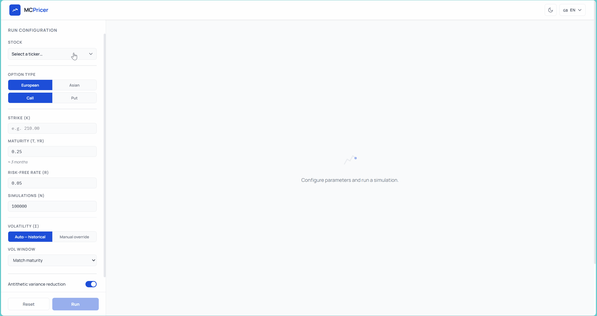

# monte-carlo-option-pricer

> Production-grade Monte Carlo Option Pricing engine with real-time convergence via WebSocket.  
> Prices European and Asian options on 7 selected DJIA stocks using real market data until 31/12/2025.




---

## What it does

> ⚠️ This tool is for educational and research purposes only. Nothing in this project constitutes financial or investment advice.

Select any DJIA stock, configure strike price, maturity and option type, and watch the Monte Carlo engine simulate up to 1,000,000 price paths in real time. The convergence chart updates live via WebSocket as each batch of 5,000 paths completes. For European options, the result is validated against the closed-form Black-Scholes benchmark.

> ⚙️ To run the app locally, see the [Run locally](#run-locally) section below.

---

## Architecture

```
Client (REST / WebSocket)
        │
        ▼
routes/simulate.py ──── routes/websocket.py
        │                       │
        ▼                       ▼
crud/stock.py          services/pricer.py
        │                       │
        ▼               ┌───────┼───────┐
models/stock.py    random_gen   gbm   payoff
        │                             │
        ▼                    european | asian
core/database.py
        │
        ▼
   PostgreSQL
```

The key design principle is **strict separation of concerns**: the simulation engine (`services/`) knows nothing about HTTP or databases, and the API layer (`routes/`) knows nothing about how Monte Carlo works. Every component is independently testable.

---

## Stack

| Layer | Technology | Why |
|---|---|---|
| Backend | FastAPI | Async-native, automatic OpenAPI docs, type-safe with Pydantic |
| Real-time | WebSocket | Push convergence batches to the client without polling |
| Database | PostgreSQL 16 + SQLAlchemy | Relational model for OHLCV time series; ORM keeps queries typed |
| Migrations | Alembic | Versioned schema changes, rollback support |
| Frontend | React 18 + Vite | Fast HMR in dev, optimised static build for prod |
| Containerisation | Docker + Compose | One-command setup, identical environments across machines |

---

## Notable technical decisions

**Antithetic variance reduction.** For each random matrix Z, the engine also simulates −Z. The negative covariance between paired payoffs reduces estimation variance without generating additional random draws, effectively doubling the statistical efficiency of each simulation run.

**Historical volatility from real data.** σ is not a user-provided constant — it is computed from the actual log-returns of the selected stock over the chosen window, then annualised by √252. S₀ is the most recent adjusted close price fetched from the database.

---

## Validation

Convergence tests run the full pipeline against the Black-Scholes analytical solution across 16 scenarios (ATM/ITM/OTM, call/put, high volatility, short and long maturity, with and without antithetic reduction). Two conditions must hold for each: relative error below 1% and the B&S price inside the MC 95% confidence interval.

---

## Run locally

> ⚠️ **Prerequisites:** [Docker Desktop](https://www.docker.com/get-started/) installed and **running**.

### Windows (recommended)

Clone the repository and double-click `start.bat`. It will:
- Configure the environment automatically
- Start the database and backend via Docker Compose
- Seed the database with 7 DJIA stocks and their historical prices
- Launch the frontend

```cmd
git clone https://github.com/Davide91-Git/monte-carlo-option-pricer.git
cd monte-carlo-option-pricer
start.bat
```

### Mac / Linux

```bash
git clone https://github.com/Davide91-Git/monte-carlo-option-pricer.git
cd monte-carlo-option-pricer
cp .env.example .env
docker compose up --build -d
docker compose exec backend python scripts/seed.py
cd frontend && npm run dev
```

The app is available at:
- Frontend → http://localhost:5173
- Backend API → http://localhost:8000
- API docs → http://localhost:8000/docs

---

## Project structure

```
monte-carlo-option-pricer/ 
├── backend/
│   ├── app/
│   │   ├── api/v1/routes/     # HTTP + WebSocket endpoints
│   │   ├── services/          # MC engine: random_generator, gbm, payoff, pricer, black_scholes
│   │   ├── crud/              # Database queries
│   │   ├── models/            # SQLAlchemy ORM (Stock, DailyPrice)
│   │   ├── schemas/           # Pydantic I/O validation
│   │   └── core/              # Database session, config
│   ├── alembic/               # Schema migrations
│   ├── tests/                 # Unit + convergence tests
│   └── scripts/seed.py        # DJIA data loader
├── frontend/
│   └── src/
│       ├── api/               # Typed HTTP + WebSocket client
│       ├── components/        # UI components
│       └── pages/             # Route-level pages
├── assets/
│   └── MCPricer.gif
├── start.bat
├── docker-compose.yml
├── Makefile
└── .env.example
```

---

## Documentation

For the statistical methodology, formulas, and academic references, see [docs/TECHNICAL_DOC.md](docs/TECHNICAL_DOC.md).

## License

MIT