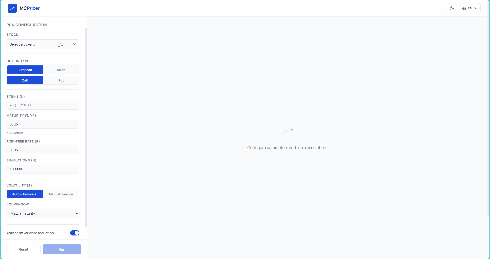
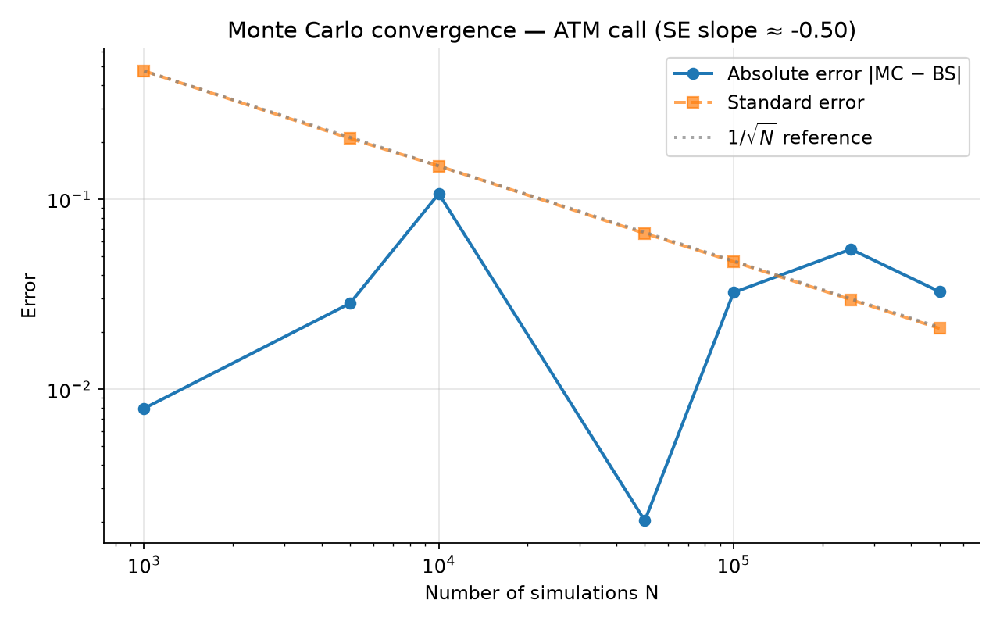
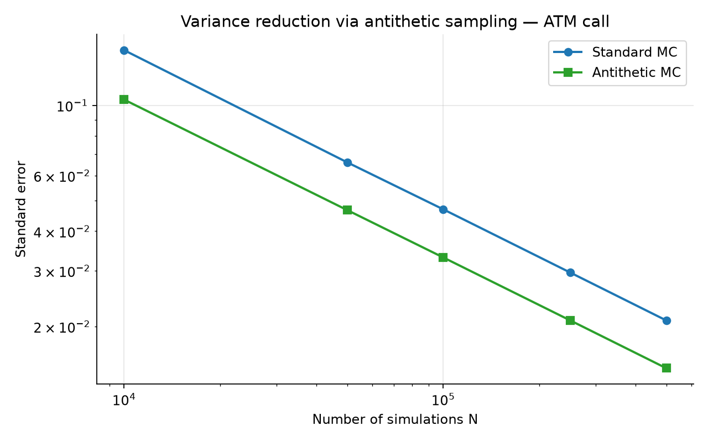
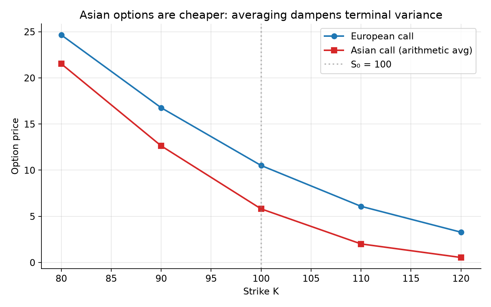

# monte-carlo-option-pricer

> Production-grade Monte Carlo Option Pricing engine with real-time convergence via WebSocket.  
> Prices European and Asian options on 7 selected DJIA stocks using real market data until 31/12/2025.


[](https://huggingface.co/spaces/dmarra91/monte-carlo-option-pricer)




---

## What it does

This is a Monte Carlo engine for pricing European and Asian options. It estimates an option's fair value by simulating thousands of possible price paths for the underlying asset. For European options, it also validates the simulation results by comparing them against the Black–Scholes closed‑form solution.

> ⚠️ This tool is for educational and research purposes only. Nothing in this project constitutes financial or investment advice.

Select a stock, configure strike price, maturity and option type, and watch the Monte Carlo engine simulate up to 1 million price paths in real time. 
The convergence chart updates live via WebSocket as each batch of 5,000 paths completes.

> ⚙️ To run the app locally, see the [Run locally](#run-locally) section below.

> 🔗 **Live demo (capped at 200k paths on free tier):** [huggingface.co/spaces/dmarra91/monte-carlo-option-pricer](https://huggingface.co/spaces/dmarra91/monte-carlo-option-pricer)

---

## Architecture

```
Client (REST / WebSocket)
        │
        ▼
routes/simulate.py ──── routes/websocket.py
        │                       │
        ▼                       ▼
crud/stock.py          services/pricer.py
        │                       │
        ▼               ┌───────┼───────┐
models/stock.py    random_gen   gbm   payoff
        │                             │
        ▼                    european | asian
core/database.py
        │
        ▼
   PostgreSQL
```

The key design principle is **strict separation of concerns**: the simulation engine (`services/`) knows nothing about HTTP or databases, and the API layer (`routes/`) knows nothing about how Monte Carlo works. Every component is independently testable.

---

## Stack

| Layer | Technology | Why |
|---|---|---|
| Backend | FastAPI | Async-native, automatic OpenAPI docs, type-safe with Pydantic |
| Real-time | WebSocket | Push convergence batches to the client without polling |
| Database | PostgreSQL 16 + SQLAlchemy | Relational model for OHLCV time series; ORM keeps queries typed |
| Migrations | Alembic | Versioned schema changes, rollback support |
| Frontend | React 18 + Vite | Fast HMR in dev, optimised static build for prod |
| Containerisation | Docker + Compose | One-command setup, identical environments across machines |

---

## Notable technical decisions

**Antithetic variance reduction.** For each random matrix Z, the engine also simulates −Z. The negative covariance between paired payoffs reduces estimation variance without generating additional random draws, effectively doubling the statistical efficiency of each simulation run.

**Historical volatility, matched to maturity.** σ is not a user-provided constant — it is computed from the actual log-returns of the selected stock, then annualised by √252. The estimation window defaults to `max(21, ⌊T · 252⌋)` trading days, matching the lookback to the option's tenor (fixed 1M/3M/6M/1Y/3Y windows are also available). S₀ is the most recent adjusted close price fetched from the database.

**Numba JIT compilation.** The GBM path simulation is compiled to machine code via Numba, with an optional multi-threaded mode (`prange`) for large simulation counts — removing the per-step Python-loop overhead that would otherwise dominate runtime as N grows into the hundreds of thousands.

---

## Validation

Convergence tests run the full pipeline against the Black-Scholes analytical solution across 14 scenarios (ATM/ITM/OTM, call/put, high volatility, short and long maturity, with and without antithetic reduction). Two conditions must hold for each: relative error below 1% and the B&S price inside the MC 95% confidence interval.

## Results

This section reports the empirical validation of the Monte Carlo engine against the Black-Scholes closed-form benchmark, together with the convergence-rate and variance-reduction analyses.

### How to read the validation table

For every scenario we price the same option in two independent ways: with the Monte Carlo engine (`MC Price`) and with the analytical Black-Scholes formula (`BS Price`). As mentioned, two conditions must hold for the scenario to count as validated:

1. The relative error $\lvert V_{MC} - V_{BS} \rvert / V_{BS}$ stays below **1%**.
2. The Black-Scholes price falls inside the Monte Carlo **95% confidence interval**.

The scenarios cover the canonical regimes used to stress-test option-pricing engines:

- **ATM** — *at-the-money*: strike equals current spot ($K = S_0 = 100$).
- **ITM** — *in-the-money*: strike favours the option holder ($K = 90$ for calls, $K = 110$ for puts).
- **OTM** — *out-of-the-money*: strike disfavours the option holder ($K = 110$ for calls, $K = 90$ for puts).
- **High vol σ=0.5** — stress test at high volatility.
- **Short T=0.1** and **Long T=3.0** — test short (~1 month) and long (3 years) maturities.
- **Antithetic** — same option, priced with antithetic variance reduction.

All other parameters are held constant: $S_0 = 100$, $r = 0.05$, $\sigma = 0.20$ (except the high-vol scenario), $T = 1.0$ year (except the short/long-maturity scenarios), $N = 500{,}000$ simulations, $252$ daily steps.
 
 
| Scenario       | Type | MC Price | BS Price | Rel Err % | CI 95%             | BS in CI |
|:---------------|:-----|---------:|---------:|----------:|:-------------------|:--------:|
| ATM            | call | 10.4832  | 10.4506  | 0.312     | [10.442, 10.524]   | ✓        |
| ATM            | put  |  5.5621  |  5.5735  | 0.205     | [5.538, 5.586]     | ✓        |
| ITM            | call | 16.7441  | 16.6994  | 0.268     | [16.696, 16.792]   | ✓        |
| ITM            | put  |  2.3108  |  2.3101  | 0.029     | [2.296, 2.326]     | ✓        |
| OTM            | call |  6.0622  |  6.0401  | 0.366     | [6.030, 6.095]     | ✓        |
| OTM            | put  | 10.6534  | 10.6753  | 0.205     | [10.620, 10.687]   | ✓        |
| High vol σ=0.5 | call | 21.8825  | 21.7926  | 0.413     | [21.768, 21.997]   | ✓        |
| High vol σ=0.5 | put  | 16.8733  | 16.9155  | 0.250     | [16.817, 16.929]   | ✓        |
| Short T=0.1    | call |  2.7818  |  2.7737  | 0.294     | [2.771, 2.793]     | ✓        |
| Short T=0.1    | put  |  2.2702  |  2.2749  | 0.206     | [2.261, 2.280]     | ✓        |
| Long T=3.0     | call | 20.9933  | 20.9244  | 0.330     | [20.912, 21.074]   | ✓        |
| Long T=3.0     | put  |  6.9810  |  6.9952  | 0.203     | [6.949, 7.013]     | ✓        |
| Antithetic     | call |  8.0272  |  8.0214  | 0.073     | [8.001, 8.053]     | ✓        |
| Antithetic     | put  |  7.9016  |  7.9004  | 0.015     | [7.881, 7.922]     | ✓        |

All 14 scenarios validate against the closed-form benchmark, with a maximum observed relative error of **0.413%** and the Black-Scholes price falling inside the Monte Carlo 95% confidence interval in every case. The two **antithetic** rows show relative errors of 0.073% and 0.015% — roughly an order of magnitude lower than the standard-sampling rows above — the empirical signature of variance reduction quantified in the dedicated section below.

> **Reproduce:** the table above and the figures below are generated by [`notebook/convergence_study.ipynb`](notebook/convergence_study.ipynb), which exercises the same `app.services.*` modules used by the API.
 
### Convergence rate
 


The Monte Carlo standard error is expected, by the Central Limit Theorem, to decay as $\sigma_X / \sqrt{N}$ — i.e. with log-log slope $-1/2$. Fitting the empirical slope on the orange curve (standard error vs $N$) yields **−0.50**, exactly the theoretical value. The dotted grey reference line overlays the orange curve, providing a visual evidence that the rate is correctly recovered across more than two orders of magnitude in $N$.

The blue line tracks the absolute error of a single run and fluctuates around the envelope: the $1/\sqrt{N}$ rate is a property of the estimator's standard error, not of any individual realisation.

 
### Antithetic variance reduction
 


The antithetic estimator's standard error sits below the standard one at every $N$, and the two curves are parallel in log-log: both decay at the same $1/\sqrt{N}$ rate. The gap quantifies a stable **~50% variance reduction**, achieved with no additional random draws.

 
### Asian vs European
 


The Asian call is cheaper than the European one at every strike, and the gap widens as $K$ moves out-of-the-money. Averaging over the path produces a more concentrated distribution than the terminal price alone, and out-of-the-money payoffs depend on the right tail that averaging dampens.

---

## Run locally

> ⚠️ **Prerequisites:** [Docker Desktop](https://www.docker.com/get-started/) installed and **running**.

### Windows (recommended)

Clone the repository and double-click `start.bat`. It will:
- Configure the environment automatically
- Start the database and backend via Docker Compose
- Seed the database with 7 DJIA stocks and their historical prices
- Launch the frontend

```cmd
git clone https://github.com/Davide91-Git/monte-carlo-option-pricer.git
cd monte-carlo-option-pricer
start.bat
```

### Mac / Linux

```bash
git clone https://github.com/Davide91-Git/monte-carlo-option-pricer.git
cd monte-carlo-option-pricer
cp .env.example .env
echo "VITE_API_URL=http://localhost:8000/api/v1" > frontend/.env
echo "VITE_WS_URL=ws://localhost:8000/api/v1/ws/convergence" >> frontend/.env
docker compose up --build -d
docker compose exec backend python scripts/seed.py
cd frontend && npm install && npm run dev
```

> ⏳ The first launch takes a few minutes — Docker will download the required images and npm will install frontend dependencies. The app will open automatically at http://localhost:5173 when ready.

The app is available at:
- Frontend → http://localhost:5173
- Backend API → http://localhost:8000
- API docs → http://localhost:8000/docs

---

## Project structure

```
monte-carlo-option-pricer/ 
├── backend/
│   ├── app/
│   │   ├── api/v1/routes/     # HTTP + WebSocket endpoints
│   │   ├── services/          # MC engine: random_generator, gbm, payoff, pricer, black_scholes
│   │   ├── crud/              # Database queries
│   │   ├── models/            # SQLAlchemy ORM (Stock, DailyPrice)
│   │   ├── schemas/           # Pydantic I/O validation
│   │   └── core/              # Database session, config
│   ├── alembic/               # Schema migrations
│   ├── tests/                 # Unit + convergence tests
│   └── scripts/seed.py        # DJIA data loader
├── frontend/
│   └── src/
│       ├── api/               # Typed HTTP + WebSocket client
│       ├── components/        # UI components
│       └── pages/             # Route-level pages
├── notebook/
│   └── convergence_study.ipynb  # Reproducible validation, convergence & variance-reduction study
├── docs/
│   └── TECHNICAL_DOC.md       # Statistical methodology and formulas
├── assets/
│   ├── MCPricer.gif
│   ├── convergence_log_log.png
│   ├── antithetic_comparison.png
│   └── asian_vs_european.png
├── start.bat
├── docker-compose.yml
├── Makefile
└── .env.example
```

---

## Documentation

For the statistical methodology, formulas, and academic references, see [docs/TECHNICAL_DOC.md](docs/TECHNICAL_DOC.md).

## License

MIT